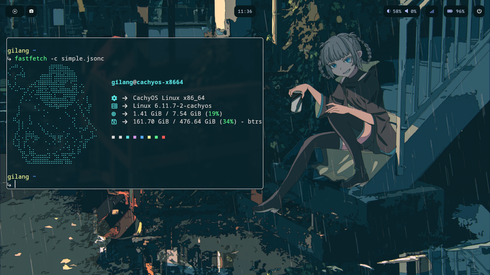

## Hyprland Dotfiles



### Decription

This repository contains my personal configuration files (dotfiles) for Hyprland. These dotfiles help me keep my environment consistent across different machines and can be easily shared or restored.

### How To Use

1. Install Package
sudo pacman -S hyprland waybar hyprpaper wlogout rofi kitty fastfetch thunar

1. **Clone the Repository**

   ```sh
   git clone https://github.com/gilangarya01/arch-xfce-dotfiles.git ~/
    ```
